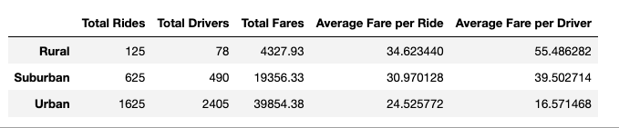
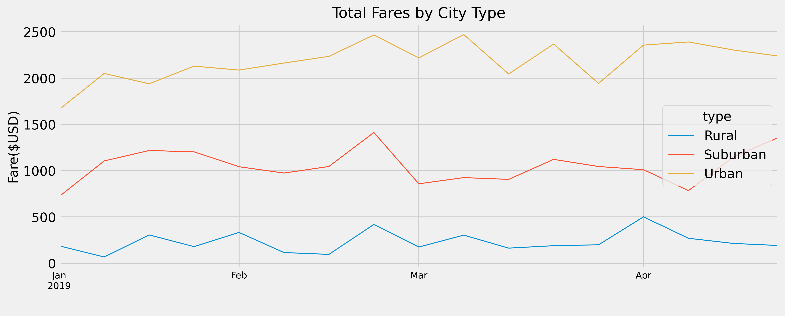

# PyBer_Challenge

## Overview & Purpose

This project is to visualize the rideshare data for a Pyber,a ride sharing company to help them to improve their ridesharing services.This will further help the company to understand the cities and their riding trends.To do this they have provided us two different data files which have information about the cities and the rides. We will do our analysis process on these two files and merge them together to create a summary Data file. We will also create a line chart graph to visualize the weekly graph of rides by the city type that is urban, suburban, rural.

We will use python,Matplotlib and Pandas libraries to create data-frames and visualize the data.

## Results

### Summary DataFrame

We read the data from two different files and concluded into one data frame.

- The highest revenue generating city type is Urban which is $39,854.38.
- Urban revenues is more than twice of revenue of suburban city type which sits at $19,356.33.
- The total number of urban rides are 1625 which is 1500 more rides than rural rides.This concludes that urban rides are 13x the rural rides.
- Same scenario in case of number of drivers,the total number of urban drivers.Urban drives are 31 times higher than rural count of drivers.Sub urban       driver count is aproximately 0.25 of the urban driver count.
- According to the basics of the bussiness,more the volume lower the average price of the sale gets.The average ticket of the urban ride is lowest         averageing $25.53 per ride.The lowest revenue genrating categoty has highest average ticket of $34.62

### Line chart visualtization

Visualization is great way for anyone to easily understand the data and its trends.
- Busiest week for the city types is third week of Feburary.
- There is sharp decline in revenue for all city types in last week of Feburary.
- Revenue range for Urban: 1600-2500(USD)
- Revenue range for Suburban: 600-1400(USD)
- Revenue range for Rural: 0-500(USD)
- The revenue increase for Urban cities is gradual with time.

## Detailed Analysis-Getting Sumamry DataFrame

### Using Magic methods
      
      # Add Matplotlib inline magic command
      %matplotlib inline

### Adding Dependencies
    
    # Dependencies and Setup
    import matplotlib.pyplot as plt
    import pandas as pd
    # Import the style from Matplotlib.
    from matplotlib import style

### Loading and Reading CSV files

    # File to Load
    city_data_to_load = 'Resources/city_data.csv'
    ride_data_to_load = 'Resources/ride_data.csv'

    # Read the City and Ride Data
    city_data_df = pd.read_csv(city_data_to_load)
    ride_data_df = pd.read_csv(ride_data_to_load)
    
 ### Merge DataFrames
 
     # Combine the data into a single dataset
      pyber_data_df = pd.merge(ride_data_df, city_data_df, how="left", on=["city", "city"])

      # Display the data table for preview
      pyber_data_df.head()
      
  ### Getting the Summary Dataframe
  
  To get the summary,we created individual summaries of differnt kind of data and merging them to create one       summary dataframe.
  
  1. Get the total rides for each city type.
            
            ride_count_bytype=pyber_data_df.groupby("type").count()["ride_id"]
            ride_count_bytype.rename("Total Rides")

  2. Get the total drivers for each city type.

            driver_sum_bytype=city_data_df.groupby("type").sum()['driver_count']
            driver_sum_bytype.rename("Total Drivers")
            
  3. Get the total amount of fares for each city type.

            total_fare_bytype=pyber_data_df.groupby("type").sum()["fare"].round(2)
            total_fare_bytype.rename("Total Fares")
            
  4. Get the average fare per ride for each city type.

            avg_fare_bytype=pyber_data_df.groupby("type").mean()["fare"]
            avg_fare_bytype.rename("Average Fare per Ride")
            
  5. Get the average fare per driver for each city type. 

            a=total_fare_bytype/driver_sum_bytype
            avg_fare_per_driver=a.to_frame(name="avg_fare_per_driver")
            avg_fare_per_driver
            
  6. Create a PyBer summary DataFrame. 

            # Combine the data into a single dataset
            pyber_summary_df = pd.merge(pd.merge(pd.merge(pd.merge(ride_count_bytype,
                                          driver_sum_bytype,on="type"),
                                        total_fare_bytype,on="type"),
                                        avg_fare_bytype,on="type"),
                                          avg_fare_per_driver,on="type")
            #Renaming the columns
            pyber_summary_df=pyber_summary_df.rename(columns=
                                                       {"ride_id":"Total Rides",
                                                        "driver_count":"Total Drivers",
                                                        "fare_x":"Total Fares",
                                                        "fare_y":"Average Fare per Ride",
                                                        "avg_fare_per_driver":"Average Fare per Driver"
                                                       })
            # Display the data table for preview
            pyber_summary_df.head()
            

## Detailed Analysis-Creating Line Plot.
This will explain steps to create line plot that shows the total weekly of the fares for each type of city.We used groupby and sum to get data from our summary daframe.

### 1. Read the merged DataFrame
            
            # 1. Read the merged DataFrame
            pyber_data_df.head()
            
### 2. Sum of fares by date and type

            # 2. Using groupby() to create a new DataFrame showing the sum of the fares 
            #  for each date where the indices are the city type and date.
            fare_sum_bydate=pyber_data_df.groupby(['date','type']).sum()['fare']
            fare_sum_bydate
            
### 3.Reset the index on the DataFrame

            fare_sum_bydate = fare_sum_bydate.reset_index()
            
### 4.Creating pivot table with date as index.

            fare_sum_bydate=fare_sum_bydate.pivot(index='date',columns='type',values='fare')
            
### 5. Filtering data for specific date range.

            dated_fare_sum = fare_sum_bydate.loc['2019-01-01':'2019-04-29']
            dated_fare_sum.tail()
       
### 6. Set the "date" index to datetime datatype.

            dated_fare_sum.index = pd.to_datetime(dated_fare_sum.index)
            
### 7. Resample the data as sum of fare by weeks.

            resampled_df=dated_fare_sum.resample('W').sum()
            
### 8.Plottting the line chart using Object Oriented interface method.

            fig,ax=plt.subplots(figsize=(12, 5))
            resampled_df.plot(kind='line',ax=ax, linewidth=1)
            fig.subplots_adjust(right=3)
            ax.set_title('Total Fares by City Type',fontsize=16)
            ax.set_ylabel('Fare($USD)',fontsize=14)
            ax.xaxis.set_tick_params(labelsize=10)
            ax.set_xlabel(" ")
            fig.tight_layout()
            fig.savefig('Analysis/image11.png',bbox_inches='tight',dpi=100)
            # Use the graph style fivethirtyeight.
            style.use('fivethirtyeight')

